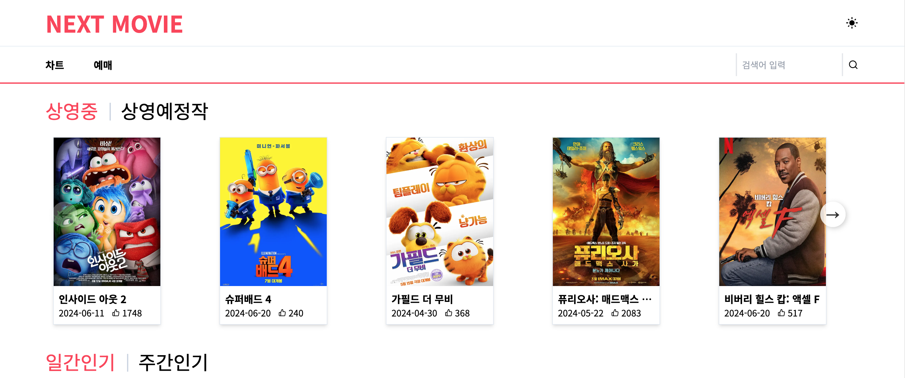
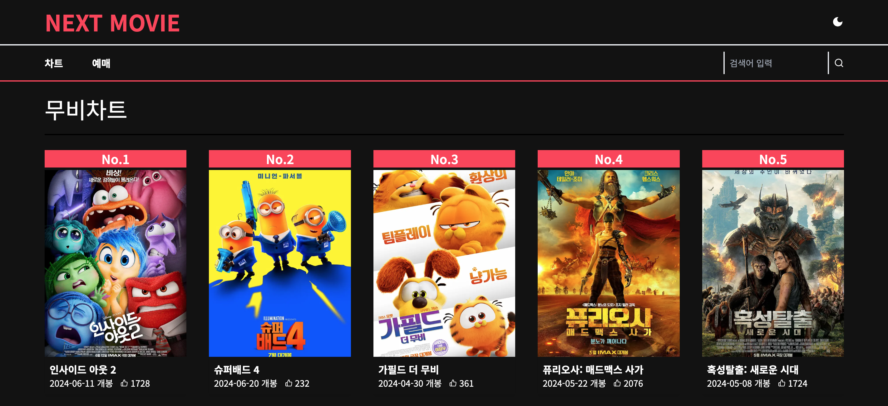

# Movie App (Next.js + TypeScript + Tailwind CSS)

이 프로젝트는 영화 정보를 제공하는 Next.js 기반의 웹 애플리케이션입니다. 무비차트와 상영예정작 등의 영화 정보를 확인할 수 있습니다.

- [DEMO](https://next-ts-movie-app.vercel.app/)




## 주요 기능

- 메인 페이지: 상영예정작, 인기영화 등의 목록을 슬라이드 형태로 출력
- 차트 페이지: 무한 스크롤 형식으로 목록 출력
- 영화 클릭 시 상세 정보 페이지로 이동
- 영화 장르, 개봉일, 평점, 상영 시간 표시
- 영화 검색 기능
- 다크 모드 변경

## 설치 및 실행 방법

1. 저장소를 클론합니다.

```bash
git clone https://github.com/fromnowwon/next-ts-movie-app
```

2. 프로젝트 폴더로 이동합니다.

```bash
cd nex-ts-movie-app
```

3. 필요한 패키지를 설치합니다.

```bash
npm install
```

4. 개발 서버를 실행합니다.

```bash
npm run dev
```

5. 웹 브라우저에서 `http://localhost:3000`을 엽니다.

## 사용 기술

- Next.js
- React
- TypeScript
- JavaScript
- Tailwind CSS

## 사용된 API

TMDB API: 영화 정보 제공을 위한 API (TMDB)

## 사용된 라이브러리

- swiper: 슬라이드 형태로 출력 시 사용
- react-intersection-observer: Intersection Observer API를 사용하여 요소가 뷰포트에 들어오거나 나갈 때 콜백을 실행. 무한 스크롤 구현 시 사용
- react-icons: 아이콘
- framer-motion: 영화 목록 마운트 시 애니메이션 효과 적용

## 폴더 및 파일 구조

```plaintext
├── public/
├── src/
│   ├── app/
│   │   ├── chart/
│   │   ├── detail/
│   │   ├── search/
│   │   ├── ticket/
│   │   ├── page.js
│   │   ├── layout.js
│   ├── components/
├── package.json
├── README.md
└── ...
```

- **app/**: 페이지, 레이아웃 관리
- **components/**: 컴포넌트 파일들

## 저자

- [Chaewon Jeong](https://github.com/fromnowwon)

## 라이센스

이 프로젝트는 MIT 라이센스 하에 배포됩니다. 자세한 내용은 LICENSE 파일을 참조하세요.

```

위 README.md 예시는 프로젝트의 구조, 설치 및 실행 방법, 주요 기능, 기여 방법, 저자 정보, 라이센스 등을 포함하고 있습니다. 프로젝트의 특성에 맞게 세부적으로 수정하여 사용하시면 됩니다.
```
